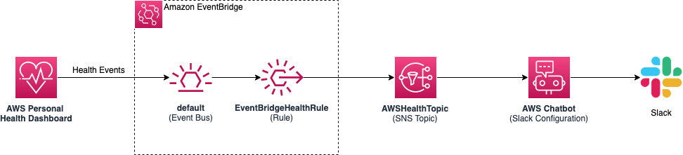

# Monitor AWS Health using Slack

This repository demonstrates how AWS Chatbot can be configured to send Slack notifications for events that impact the health of AWS resources within your account.

Monitoring the health of AWS resources is an important aspect of ensuring the reliability and availability of your cloud applications. Operations teams often find that their monitoring information exists in multiple different locations including application logs, Amazon CloudWatch, AWS Health, and more. The process of aggregating and sharing this information can be a time-consuming manual process and can become an operational bottleneck. 

ChatOps is the process of using familiar messaging platforms, such as Slack and Amazon Chime, to manage software deployment and operation tasks. Using ChatOps, teams can manage their environments right from their chat clients and easily share their findings with their peers. 

AWS Chatbot is an interactive agent that makes it easy to monitor, operate, and troubleshoot your AWS workloads in your chat channels. With AWS Chatbot, you can receive alerts, run commands to retrieve diagnostic information, configure AWS resources, and initiate workflows.

Another way to create this ChatOps workflow is by creating a custom AWS Lambda function that responds to AWS Health events. This [Github repository](https://github.com/aws/aws-health-tools/tree/master/slack-notifier) includes instructions for how to approach the problem using this method.

## Architecture:


## Prerequisites: 
- Slack account, workspace, and channel
- AWS account
- AWS CLI configured (if using the CLI command below, follow the instructions to [configure the AWS CLI](https://docs.aws.amazon.com/cli/latest/userguide/cli-chap-configure.html). Otherwise, the Stack can be created in the AWS CloudFormation console)
- AWS Chatbot configured with Slack client (see steps 1-4 in the "Setting Up AWS Chatbot with Slack" section of this [documentation page](https://docs.aws.amazon.com/chatbot/latest/adminguide/getting-started.html#chat-client-setup))

## How to get Slack information:

#### Workspace ID

To get the workspace ID, you must perform the initial authorization flow with Slack in the AWS Chatbot console. Then you can copy and paste the workspace ID from the console. 

#### Channel ID

To get the channel ID, open Slack, right click on the channel name in the left pane, then choose Copy Link. The channel ID is the 9-character string at the end of the URL. For example, ```ABCBBLZZZ```.

## Command to create stack:
```
aws cloudformation create-stack \
  --stack-name AWSHealthSlackNotifications \
  --template-body file:///<PATH_TO_CLOUDFORMATION_FILE> \
  --parameters ParameterKey=SlackWorkSpaceID,ParameterValue=<SLACK_WORKSPACE_ID> ParameterKey=SlackChannelID,ParameterValue=<SLACK_CHANNEL_ID>
  --capabilities CAPABILITY_IAM
```